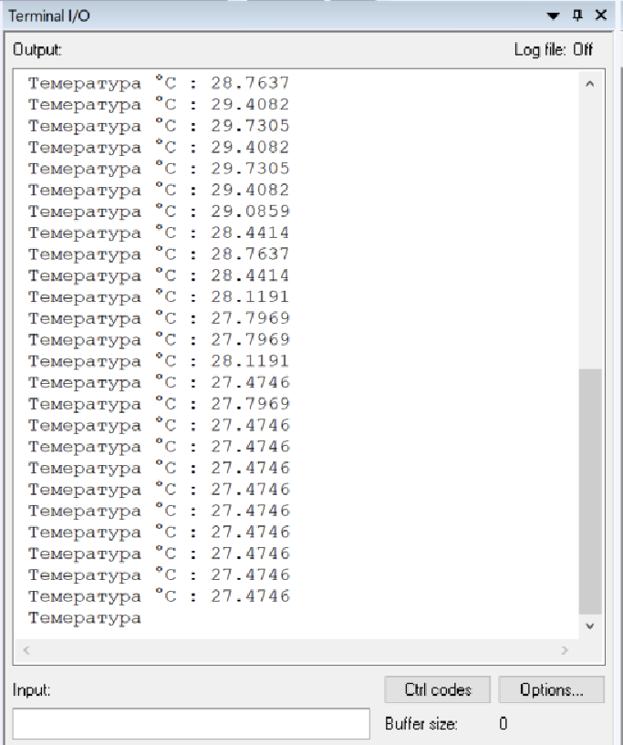

=== Цифровой термометр

Задание:

.Задание
image::photos/zadanie.png[]

===  Выолнение задания

Необходимо создать устройство, считывающее значения температуры с процессора и передача их в консоль.

Получаем такой алгоритм:

Производим стандартную настройку портов.

Подключаем АЦП к источнику тактирования:
----
RCC::APB2ENR::ADC1EN::Enable::Set();
----
НАстраиваем порт температурного датчика:
----
ADC1::SQR3::SQ1::Channel18::Set();
----
Включаем порт температурного датчика:
----
*ADC_Common::CCR::TSVREFE::Enable::Set();*
----

Далее идет настройка АЦП:

1)Устанавливаем разрядность _12_;

2)Устанавливаем режим одночного преобразования;

3)Устанавливаем режим одночного преобразования;

4)Количество измерений ставим _1_;

5)Ставим скорость дискретизации _84_;

6)Включаем АЦП.

----
ADC1::CR1::RES::Bits12::Set();
ADC1::CR2::CONT::SingleConversion::Set();
ADC1::CR2::EOCS::SingleConversion::Set();
ADC1::SQR1::L::Conversions1::Set();
ADC1::SMPR1::SMP18::Cycles84::Set();
ADC1::CR2::ADON::Enable::Set();
----

Получение значений температуры:
В цикле запускаем преобразование и проверяем готовность, запрашиваем бит из регистра _data_.
Так как датчик передает данные в своем формате, пользуясь Datasheet находим формулу для преобразования значений в градусы Цельсия.
Получаем такой код:

_Также, для правильного отображения температуры, нужно перевести полученные с устройства данные в
данные, понятные для пользователя._

Для этого используем формулу из *Datasheet*:
----
Temp = ((((data*3.3)/4096 - V25)/AVG_Slope)+25.0);
----

Теперь проверим показания в консоли, меняя температуру.

.Полученные измерения

Также в программу была добавлена простая индикация температуры, путем зажигания светодиодов.
Диапазон температуры можно задать в коде, для наглядности был выбран диапазон _26-29_ градусов Цельсия.
Ниже представлена его работа:

image::https://github.com/Dimooon174/TempSensor/blob/main/Photos/MOV_0040.gif[]

Код "индикатора" в полном коде программы.

Полный код программы:
[source, cpp]
----
#include <cstdint>
#include "gpioaregisters.hpp"
#include "gpiocregisters.hpp"
#include "rccregisters.hpp"
#include "tim2registers.hpp"
#include "nvicregisters.hpp"
#include "adc1registers.hpp"
#include "adccommonregisters.hpp"
#include <iostream>

extern "C"
{
int __low_level_init(void)
{
RCC::CR::HSEON::On::Set();
while (!RCC::CR::HSERDY::Ready::IsSet())
{ }
RCC::CFGR::SW::Hse::Set();
while (!RCC::CFGR::SWS::Hse::IsSet())
{ }
RCC::CR::HSION::Off::Set();
RCC::AHB1ENR::GPIOAEN::Enable::Set();
RCC::AHB1ENR::GPIOCEN::Enable::Set();
GPIOC::MODER::MODER5::Output::Set();
GPIOA::MODER::MODER5::Output::Set();
GPIOC::MODER::MODER9::Output::Set();
GPIOC::MODER::MODER8::Output::Set();
RCC::APB2ENR::ADC1EN::Enable::Set();
ADC1::SQR3::SQ1::Channel18::Set();
ADC_Common::CCR::TSVREFE::Enable::Set();
ADC1::CR1::RES::Bits12::Set();
ADC1::CR2::CONT::SingleConversion::Set();
ADC1::CR2::EOCS::SingleConversion::Set();
ADC1::SQR1::L::Conversions1::Set();
ADC1::SMPR1::SMP18::Cycles84::Set();
ADC1::CR2::ADON::Enable::Set();
}
}
float V25 = 0.76F;
float AVG_Slope = 0.0025F;
float Temp = 0.0F;
int main()
{

  for(;;)
  {
    ADC1::CR2::SWSTART::On::Set();
     while(!ADC1::SR::EOC::ConversionComplete::IsSet())
    {};
  uint32_t data =   ADC1::DR::Get(); //Get data from ADC;
  Temp = ((((data*3.3)/4096 - V25)/AVG_Slope)+25.0);
  std::cout << " Темература °С : " <<  Temp << std::endl;
  if(Temp>26)
  {
    GPIOC::BSRR::BS5::High::Write();
  }
  else
  {
    GPIOC::BSRR::BR5::Low::Write();
  }
   if(Temp>27)
  {
    GPIOC::BSRR::BS8::High::Write();
  }
  else
  {
    GPIOC::BSRR::BR8::Low::Write();
  }
   if(Temp>28)
  {
    GPIOC::BSRR::BS9::High::Write();
  }
  else
  {
    GPIOC::BSRR::BR9::Low::Write();
  }
   if(Temp>29)
  {
    GPIOA::BSRR::BS5::High::Write();
  }
  else
  {
    GPIOA::BSRR::BR5::Low::Write();
  }
}
}

----

